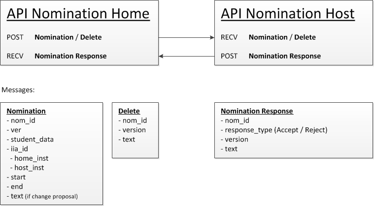

Nomination API
======================================

* [What is the status of this document?][statuses]
* [See the index of all other EWP Specifications][develhub]

Summary
-------

This document describes the **Nomination API**. These are the APIs needed to establish and maintain nominations between two partners. There is need for APIs on both sides to be able to exchange this information.

Participants
------------

* **Home institution** - The home institution is the institution where the student originates from.
* **Host institution** - The host institution is where the student wants to study. 

Basic flow
----------

The home institution initiates the work on the nomination, and proposes it to the host institution. The host institution can either accept or reject a nomination (with a textual explanation). The home institution is responsible for doing any changes, and needs to notify the host institution about them. Every time the nomination is changed by the home institution, the version is changed, so the other partner can see what state the document is in, and for the home institution to know exactly what has been approved or rejected. The version can either be an auto incremented integer, or a timestamp.

Implementation
--------------

The Nomination API will contain functionality for both the home and host institution; if you implement the Nomination API you can be both home and host in the network.

* **Home API** - Receive a Nomination Response (Accept, Reject)
* **Host API** - Receive a Nomination (Nomination XML, Delete)
